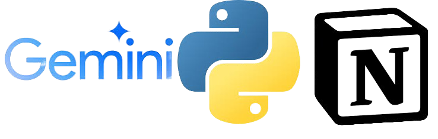

<h1 align="center">
  <picture>
    <source media="(prefers-color-scheme: dark)" srcset="pythonnotiongemini.png"/>
    <source media="(prefers-color-scheme: light)" srcset="pythonnotiongemini.png"/>
    
 <br />
</h1>

# NotionAutomations

This repository contains a collection of Python scripts designed to enhance productivity and automate tasks involving content summarization, video processing, and task notification management. The primary focus is on integrating with Notion, Google Cloud Platform (GCP), and other services to streamline workflows.

## Components

### 1. Google Gemini Vision - Notion Automation
This module automates the process of creating summaries for videos saved to the iOS Notion app. It integrates Notion, Google Cloud Platform, and Google's Gemini multimodal Large Language Model (LLM) to fetch videos, optionally compress them, and generate summaries using advanced AI techniques. The summarized content is formatted in HTML for easy integration back into Notion or other platforms.

#### Key Features:
- Notion Integration: Retrieves videos from a Notion database.
- Video Processing: Compresses videos if they exceed a specified size limit.
- Google Cloud Storage: Uploads processed videos to Google Cloud for further processing.
- Google's Gemini Model: Generates summaries of the videos using advanced AI.
- Pipedream Workflow: Orchestrates the entire process, triggered when a new note with a video is created in Notion.

### 2. Misc Automations
This collection of scripts is designed to automate routine tasks involving content summarization, video processing, and task notification management. Each script leverages cutting-edge technology and integrates seamlessly with popular services like Notion, AWS, Google Cloud Platform, and Pushover.

#### Key Features:
- URL Information Extractor and Summarizer to Notion: Extracts key information from URLs, summarizes web content, and saves these summaries to a Notion database.
- Video Summarizer to Notion: Compresses videos, uploads them to Google Cloud Storage, and generates summaries using Vertex AI.
- NotionGPT Notification System: Sends notifications for tasks managed in Notion, utilizing AWS Secrets Manager for secure information storage and Pushover for notification delivery.

## Setup and Configuration

### Prerequisites:
- Python 3.6 or later.
- Access to Google Cloud Platform and a configured GCP bucket.
- A Notion account with API access.
- Pipedream account for workflow automation.
- AWS account for Secrets Manager and Pushover for notifications.

### Installation:
1. Clone the repository to your local machine.
2. Install the required Python packages:
   ```bash
   pip install -r requirements.txt
   ```
3. Set up your GCP credentials and Notion API access.
4. Configure AWS credentials for Secrets Manager and Pushover.

### Usage:
- Follow the individual README files in the respective directories for detailed usage instructions.

## Contributing
Contributions are welcome. Please follow the standard GitHub pull request process to submit your changes.

## License
This project is released under the MIT License, allowing for both personal and commercial use with proper attribution.

## Contact
For any queries or collaboration requests, please reach out to tylerkline@gmail.com.
